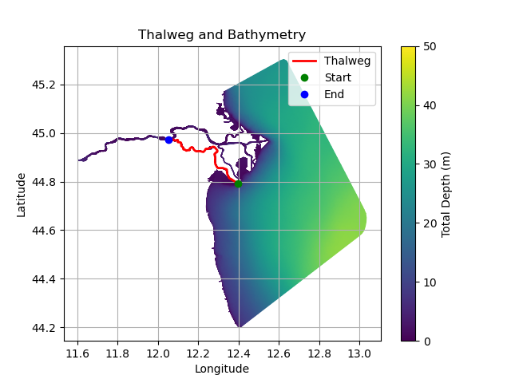
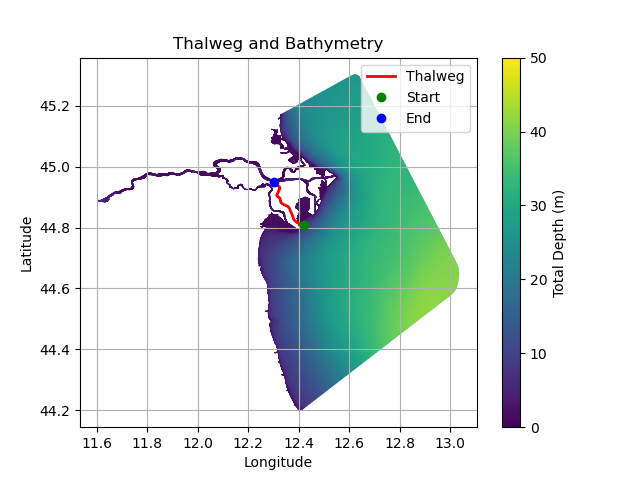
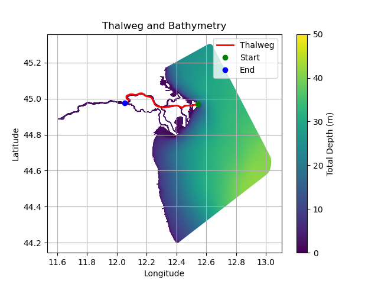
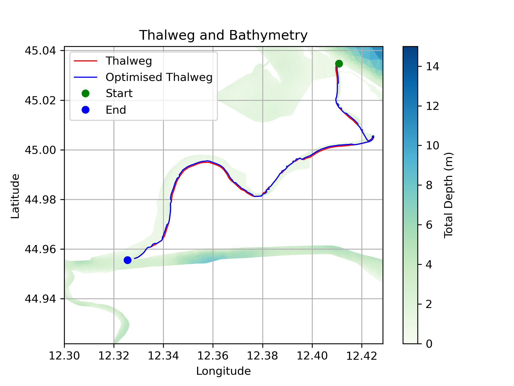
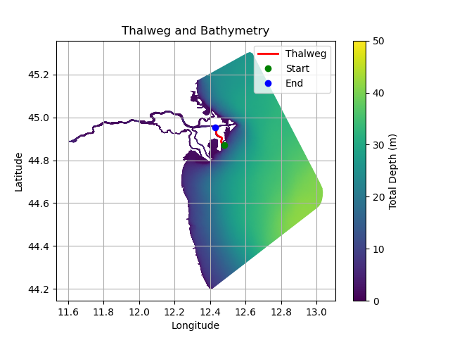

# ETICO -- EstuarIO Thalweg Identification Code
_A python software to identify the thalweg in a river_

<p align="center">

</p>

## Preparation

Before running the script, you have to (create and) activate the proper environment. The creation can be done with:

```
$ conda create -n etico
$ conda activate etico
$ conda install python xarray cartopy termcolor matplotlib scipy
$ conda install -c conda-forge geopy
```

**NOTE:** on some systems, one of the dependencies (`libxcb`) may cause problems. In case, remove it with:

```
$ conda uninstall libxcb
```


## Invoking the script

To invoke the script:

```
$ python etico.py <NETCDF_FILE> <CONFIG_FILE>
```

Please remember to check that settings in the config file are correct. See `sample_tolle.conf` for an example.

## Tests

### Po Goro

The following are the results of determining the thalweg of Po Goro branch.
<p align="center">

</p>


### Po Gnocca

For Po Gnocca river:

<p align="center">

</p>

### Po Dritta

For Po Dritta river:

<p align="center">

</p>

### Po Maistra

For Po Maistra river:

<p align="center">

</p>


### Po Tolle

The following picture shows the result of running the algorithm on the Po Tollo branch of Po river.

<p align="center">

</p>

